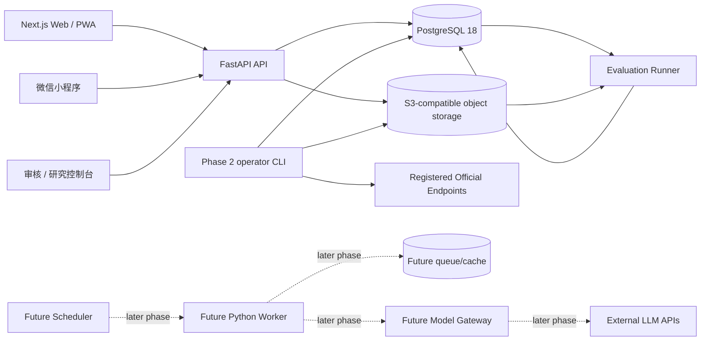

# DeepAha 系统架构基线

**状态：** `PROPOSED`  
**架构形态：** 模块化单体（modular monolith）  
**适用范围：** Phase 0–Beta；只有监控证据证明某个模块需要独立扩缩容或隔离故障时才评估微服务拆分。
**上位基线：** Blueprint v1.2；技术候选采用必须经过阶段 spec、开源准入和固定样本验证。

## 1. 架构目标

系统首先优化：

1. 高影响判断可追溯、可复现、可回放。
2. 原始证据与结构化结论分离，模型升级不会丢失历史事实。
3. 资格裁决确定性优先，不由自由对话或模型置信度决定。
4. 采集、解析、模型和通知任务可重试、可幂等、可审计。
5. 在小团队条件下保持模块清晰，同时避免微服务运维成本。

## 2. 运行拓扑



Phase 2 先用显式 CLI 调用同一应用服务，验证观察、幂等、重试和解析语义；不以“未来会异步”为理由提前加入队列。后续允许 API、Worker、Scheduler 和 Evaluation Runner 共享同一 Python 包，但必须以独立进程入口运行。共享代码不等于共享职责。

Phase 4 候选当前把 Evaluation Runner 实现为离线验证库和隔离验证脚本，不部署长期
进程、API 或 UI。其确定性路径是 `OpportunityVersion + Approved RuleSet + versioned
synthetic ProfileSnapshot -> EligibilityResult -> MatchSnapshot -> EvaluationRun`；每次运行
固定编译器、引擎、专业目录/映射、场景时钟、输入哈希和 EvidenceRef。该候选受 Phase
2/3 Gate 阻塞，不代表已发布运行拓扑。

Phase 6 工程实现新增只在 `development/test` 开启的 fixture 身份边界、`/api/v1/me` 个人 API
和响应式 Web/PWA Server Action。FastAPI 从凭据解析 principal，Next.js 仅在服务端读取临时
Cookie；PostgreSQL 保存凭据摘要、不可变画像/排序/行动快照和审计事件。该拓扑不是生产身份、
部署或 Release Qualification 证据。

## 3. 代码仓库布局

```text
DeepAha/
├── AGENTS.md
├── README.md
├── backend/
│   ├── pyproject.toml
│   ├── uv.lock
│   ├── src/deepaha/
│   │   ├── api/
│   │   ├── core/
│   │   ├── sources/
│   │   ├── artifacts/
│   │   ├── documents/
│   │   ├── opportunities/
│   │   ├── rules/
│   │   ├── eligibility/
│   │   ├── profiles/
│   │   ├── personal/
│   │   ├── matching/
│   │   ├── actions/
│   │   ├── feedback/
│   │   ├── review/
│   │   ├── evaluation/
│   │   └── notifications/
│   ├── migrations/
│   └── tests/
├── web/
│   ├── app/
│   ├── features/
│   ├── lib/
│   ├── public/
│   └── tests/
├── contracts/
│   ├── schemas/
│   └── examples/
├── infra/
│   └── compose.yaml
├── scripts/
└── docs/
```

约束：

- 业务模块按领域责任拆分，不按 controller/service/repository 技术层堆成全局目录。
- `core/` 只放跨领域基础能力，如设置、日志、时钟、ID 和错误格式；不得变成杂物箱。
- 模块只能通过公开应用服务和显式类型交互，不跨模块直接操作对方内部表或私有函数。
- `contracts/` 保存跨语言 JSON Schema 与样例；Python 模型和 TypeScript 类型由同一契约生成或经过一致性测试。

## 4. 模块职责

| 模块 | 单一职责 | 不负责 |
| --- | --- | --- |
| `sources` | 官方源/Endpoint 注册、抓取策略、CaptureObservation、健康和频率 | 解析业务字段 |
| `artifacts` | 原始字节、哈希、对象键和不可变留存 | 判断同一机会 |
| `documents` | 多格式解析、标准文本和证据定位 | 最终资格裁决 |
| `opportunities` | 机会归并、稳定身份、版本、事件和状态 | 用户偏好排序 |
| `rules` | 规则 DSL、编译、证据和审核状态 | 保存用户行为 |
| `eligibility` | 用确定性规则产生资格四态 | 个性化价值排序 |
| `profiles` | 最小画像、动态状态、版本和用户控制 | 机会事实 |
| `personal` | 服务端身份/用途边界与画像、匹配、行动的用户级编排 | 生产身份、反馈审核或通知 |
| `matching` | 组合资格、偏好、价值、紧迫性和不确定性 | 覆盖硬资格结论 |
| `actions` | 保存、官方跳转、材料计划和真实行动状态 | 自动代报名 |
| `feedback` | 接收原始反馈、证据声明和处理状态 | 直接修改规则 |
| `review` | 人工队列、裁决、SLA 和审计 | 静默改写历史快照 |
| `evaluation` | 数据集、回放、指标、差异和发布证据 | 线上自由试错 |
| `notifications` | 事件到通知、用户频率、幂等发送和失败审计 | 生成机会事实 |

## 5. 核心数据流

### 5.1 写入时智能

```text
Source poll
  -> CaptureObservation (one row per attempt)
  -> RawArtifact (immutable bytes + hash; reused for identical content)
  -> Document (parser output + evidence locators)
  -> Opportunity resolve
  -> OpportunityVersion / Event
  -> Rule compile
  -> review if uncertain or conflicting
  -> publish version
```

同一公告只在写入或版本变化时做昂贵解析。用户请求读取已经发布的结构化事实，再运行确定性资格和轻量排序。

### 5.2 个人判断

```text
Published OpportunityVersion
  + Approved RuleSet
  + UserStateVersion
  -> EligibilityResult + MatchSnapshot
  -> PersonalRankingSnapshot (deterministic, <= 3, 90 days)
  -> personal explanation / audited action
```

MatchSnapshot 保存资格输入版本与输出，PersonalRankingSnapshot 另行保存软排序输入和原因；
历史判断不因当前规则升级或偏好变化而被覆盖，排序也不能改写资格四态。

### 5.3 反馈学习

```text
FeedbackEvent
  -> evidence / consent check
  -> review and adjudication
  -> approved label or rejected claim
  -> offline evaluation candidate
  -> shadow comparison
  -> release decision
```

## 6. 同步与异步边界

同步 API 只承担可在用户等待时间内确定完成的操作：查询、画像更新、保存行动、反馈接收和读取评估结果。

以下操作在长期运行形态中异步执行：

- 抓取、PDF/Excel 解析、OCR、LLM 调用。
- Opportunity 归并、全量重算、批量资格回放。
- 变化检测、通知生成与发送。
- 大规模评估、数据导入和隐私导出。

异步任务要求：

- 任务负载包含稳定对象 ID 和版本，不携带不可复现的临时上下文。
- 使用幂等键防止重复副作用。
- 短暂故障采用指数退避；确定性输入错误进入审核/失败队列，不无限重试。
- 通知等跨系统副作用使用事务性 Outbox；业务事务提交成功后再发送。

Phase 2 不实现上述队列拓扑。采集和解析由显式命令同步编排，但其应用服务必须使用稳定 ID、幂等键和可注入的 transport/clock/sleeper，使未来 Worker 只能替换触发方式，不能改变领域语义。

## 7. 数据与存储规则

- PostgreSQL 是结构化事实、规则、用户状态、审核和评估的唯一事实源。
- Phase 4 候选在 PostgreSQL 中追加不可变 RuleSet、ProfileSnapshot、EligibilityResult、
  MatchSnapshot 和 EvaluationRun；旧 OpportunityVersion 和原始证据不重写。
- Phase 6 在 PostgreSQL 中追加 owner-scoped UserState、PersonalRanking、PersonalAction 和
  ActionEvent；当前用途撤销后不再读取旧个人结果，审计记录仍保留且不被就地改写。
- 对象存储保存原始 HTML/PDF/Excel/图片和不可变快照；数据库保存哈希、大小、MIME、对象键和证据引用。
- Redis 若在后续阶段引入，只用于缓存、队列、锁和限流；缓存丢失不能改变业务事实。Phase 2 不依赖 Redis。
- pgvector 若在后续阶段引入，只用于去重候选、专业语义候选和检索，不用于硬资格最终裁决。Phase 2 不创建向量列或扩展。
- 时间统一按 UTC 保存，API 使用带时区 ISO 8601；面向中国用户展示时转换为 `Asia/Shanghai`。
- 内部 ID 使用 UUIDv7；用户可见 `public_id` 稳定、不可复用、与数据库主键解耦。
- 原始记录不就地改写；纠错通过新版本、状态迁移或受审计裁决完成。

## 8. API 规则

- 路径前缀使用 `/api/v1`。
- 输入输出使用显式 Schema；禁止向前端泄漏数据库 ORM 对象。
- 错误响应使用 `application/problem+json`，至少包含 `type`、`title`、`status`、`detail`、`instance` 和 `request_id`。
- 列表接口使用游标分页；不在早期使用偏移量分页承载持续变化的大表。
- 写接口支持幂等键；高影响操作记录 actor、reason、request_id 和时间。
- 所有资格接口返回证据、缺失字段、输入版本和“最终以官方审核为准”的边界说明。
- 公共 API 不返回用户画像、内部审核备注、模型原始思维链或未发布规则。

## 9. 错误处理与不确定性

| 场景 | 系统行为 |
| --- | --- |
| 网络超时、429、临时 5xx | 有界重试并记录尝试次数 |
| 源页面永久 404/结构变化 | 更新源健康，保留上次快照，进入源审核 |
| 解析字段缺失 | 保存缺失与置信度，不猜默认值 |
| 正文与附件冲突 | 标记冲突，按证据优先级进入人工裁决 |
| 模型 Schema 不合法 | 拒绝写入发布数据，记录模型调用并重试一次或转审核 |
| 资格信息不足 | 返回 `UNCERTAIN` 与所需补充字段 |
| 通知发送失败 | Outbox 保留，退避重试，超过阈值进入失败审计 |
| 历史版本无法回放 | 阻止发布，视为评估系统高优先级故障 |

## 10. 安全、隐私与审计

- 公共、用户、审核和研究接口采用不同权限集合；管理接口不能依赖“隐藏 URL”。
- 密钥只来自环境或密钥管理系统，不写入仓库、日志、测试夹具或前端包。
- 日志默认脱敏，不记录身份证、完整生日、详细住址或模型请求中的非必要个人字段。
- 用户画像字段附带用途与来源；支持查看、更正、删除、注销和个性化推荐开关。
- 审核、规则发布、机会合并/拆分、资格覆盖和隐私请求必须产生不可抵赖审计事件。
- 备份只有经过恢复演练才算有效；Beta 前完成至少一次数据库和对象证据恢复演练。

## 11. 可观测性

从 Phase 0 起统一结构化日志和 `request_id`；接入外部监控后使用 OpenTelemetry。

最小监控面：

- API 延迟、错误率和关键写操作失败。
- Source 健康、抓取延迟、连续失败和变更率。
- 解析/模型成功率、Schema 拒绝率、人工审核积压。
- 每 100 个来源的维护分钟数、每个 Document 的采集/解析耗时与派生字节；这些是运行和成本证据，不等于产品价值。
- Opportunity 合并冲突、变更漏检和回放失败。
- 资格状态分布、错误否定、证据缺失。
- 通知成功、重复抑制、关闭与投诉。

业务指标和系统指标分开命名，禁止用系统吞吐代替产品价值。

## 12. 技术基线（2026-08-21）

| 领域 | 基线 | 说明 |
| --- | --- | --- |
| Python | 3.14.x | 当前稳定主版本；使用 `uv` 管理并锁定依赖 |
| API | FastAPI + Pydantic v2 | 依赖在实施时锁定具体补丁版本 |
| 数据访问 | SQLAlchemy 2.x + Alembic | 显式事务与迁移 |
| PostgreSQL | 18.x | 使用 UUIDv7、约束、JSONB 和事务能力 |
| Node.js | 24 LTS | 生产使用 LTS，不使用 Current 分支 |
| Web | Next.js 16.3.2 + React 19.2 | 使用 App Router；16.3.2 是已验证的安全更新，不据此扩大 Web 功能范围 |
| TypeScript | 5.x strict | 禁止隐式 `any` |
| Python 质量 | Ruff + mypy + pytest | 格式、静态检查、测试分责 |
| Web 质量 | ESLint + TypeScript + Vitest + Playwright | 单元、组件、构建和关键旅程 |
| Phase 2 HTTP | httpx2 2.x | 只用于登记 Endpoint 的有界 GET；依赖锁定前验证 Python 3.14 与许可证 |
| Phase 2 解析 | lxml 6.x、pypdf 6.x、openpyxl 3.x、defusedxml 0.x | HTML、文本型 PDF、XLSX 的确定性适配器；不代表 Docling/OCR 已获批 |

版本来源（核验于 2026-08-21）：[Python 3.14 稳定版](https://www.python.org/downloads/release/python-3140/)、[Node.js 发布状态](https://nodejs.org/en/about/previous-releases)、[PostgreSQL 18 发布说明](https://www.postgresql.org/about/press/presskit18/en/)和 [Next.js 发布日志](https://nextjs.org/blog)。实施时更新补丁版本，但不静默跨主版本。

## 13. 架构决策边界

以下变化需要独立 ADR 或 spec：

- 拆分微服务或引入消息流平台。
- 更换 PostgreSQL 事实源或引入第二个写主库。
- 让模型输出直接影响高影响资格状态。
- 改变 Opportunity 稳定身份、合并或版本语义。
- 扩展 OpportunityType、改变 CaptureObservation/RawArtifact 边界或 Evidence Locator 结构。
- 引入浏览器默认采集、Document AI、OCR、实时模型解析或分布式任务系统。
- 引入新的个人敏感字段、自动化重大决策或代报名能力。
- 引入付费排序、广告、商业置顶或第三方画像共享。

普通依赖补丁、安全修复和模块内部重构不需要 ADR，但必须通过现有测试和 Gate。
