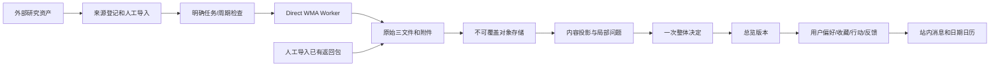

# 产品目标、技术架构与明确取舍

版本：3.0.0-rc1；实施记录：2026-09-16 UTC / 2026-09-17 北京时间。目标是重新建立“拿到结果就能使用”的产品闭环，不再以完善所有验证研究能力为前置。

## 1. 权威与范围
当前用户的重新开发委托授权直接执行，取代输入规划中的“本轮仅规划”。业务规则按 2026-09-13/14 整体审核规划，视觉按第二版；更早关于 Gold、逐字段核验、Native Automation Worker 和复杂模型网关的阶段顺序不恢复。公开机会免费，付费服务、人格、社区、泛资讯和全国全量覆盖不扩建。

采用**替换装配入口、保留有效资产**，而非仅改按钮，也非删除全部旧代码。审核、系统维护、个人使用三种权限独立；一个账号可以同时获多种权限。原数据库与原件在本轮未被访问或改写。

## 2. 两个备选为何不采用
继续在旧审核链补缺：复用表面多，却继承方法/事实/规则/发布互相阻断，不解决用户诉求。
完全复制成独立新系统：容易产生第二个来源、机会身份与证据库，丢弃已有传输/存储经验。
当前选择：沿用来源、机会稳定身份列，复用不可覆盖对象存储与 Direct WMA；重写当前产品服务和页面装配，旧运行仅保留只读和源码。新账号取代 fixture 身份，新任务记录替代依赖旧事实生产的编排，都是明示的替换，不并行启动两条生产线。

## 3. 模块化单体

FastAPI 同时提供 API 和当前前端资产；SQLAlchemy 管事务；Pydantic 限制操作输入。SQLite 是实测本地运行路径，PostgreSQL 是代码与配置支持但本轮未实测的部署路径。所有远程操作在独立 Worker 中，不在读取页面或保存批准的事务中调用模型。

## 4. 前端选择：保留视觉，替换旧运行依赖
当前前端为原生 ES Modules、HTML、CSS，同源请求真实 API。复用 V2 样式及图标，不复制原型 fixtures、localStorage 状态或演练开关。主流程不需要 Node；需要保留原来 3000 端口时，`web/server.mjs` 可作同源代理。
这**偏离输入规划沿用 Next/React 的部署选择**，原因是旧 Next 根页面、动作、Cookie 请求和业务装配仍连接旧审核路径。保留其源码和原 package 配置供逐模块迁移，但不宣称当前默认产品还以 Next 构建。只有一套运行前端，不并行维护两个业务状态机。

## 5. 数据层
| 层 | 当前表或资产 | 责任 |
|---|---|---|
| 原始证据 | 内容寻址对象、返回包 manifest | 文件不覆盖，读取重算哈希 |
| 来源 | 既有 `sources` + `product_source_profiles` | 稳定来源身份、允许域名、Brief、启停与检查周期 |
| 正式机会身份 | 既有 `opportunities` + `product_opportunity_identity` | 来源内可靠键关联，不按标题相似合并 |
| 当前内容 | `product_result_snapshots`、`product_overview_revisions` | 可由原件再生；保留局部缺口 |
| 收录与展示 | `product_overview_decisions`、`product_overview_publications` | 精确版本一次决定及允许公开内容 |
| 用户 | `product_accounts`、会话、画像、行动、反馈、消息 | 同一账号固定权限，用户数据独立 |
| 运维 | 当前任务、管理记录、导入回执、Meta | 可恢复、可追溯，不代替内容批准 |

表名以 `docs/rebuild/schema-inventory.json` 和实际 models.py 为准。没有生成假的 `VerifiedFact`、`RuleSet` 或旧 `OpportunityVersion` 来满足旧必填字段。旧身份需要明确的迁移映射时，通过 CLI 受控建立，不擅自猜测。

## 6. 审核职责
收到文件即落原始存储，再逐项适配。可读结果包含整包范围、子对象数量、材料及备注。整包错误只限可安全读取性、基本身份归属与关键原件完整性；单个对象错误局部排除，其他可用对象仍可收录。
审核员只提交 APPROVE/REJECT、preview_hash、幂等键和一条可选整体说明；不通过须填原因。决定与总览版本同事务提交。相同请求重读原回执；相反决定不覆盖已提交结果；新版本到达后旧待审版本不能抢回当前内容。

## 7. 并发与恢复
SQLite 用 WAL、外键与 BEGIN IMMEDIATE；PostgreSQL 当前采用固定 advisory transaction lock 串行化短写事务。该方案偏向小规模可靠性，不声明已经验证高并发承载。远程 WMA 不持数据库锁；恢复只连接已知 Session 回收已存在文件，不自动再次发送 Prompt。
保存失败可重试原幂等请求；技术中断不产生人工 REJECT。客户端读取版本变化返回冲突提示，刷新当前内容，不在通过后增加第二次人工审批。

## 8. 内容与使用限制
陌生字段、重复标签、完整原句保留；深层对象超过常规布局时以原始结构文本保留。公开内容使用白名单，已排除字段、内部键、凭据和审核身份不公开。正文按纯文本渲染，来源仅允许安全 http/https 地址。
本地引用检查只支持已保存 UTF-8 文本/HTML 等精确子串定位；PDF/Office 引用不被伪装成已经定位，但仍可带备注展示。定位不是语义核验，也不是范围和例外覆盖证明。
确定日期必须同时有无冲突的原值和狭窄格式的实际引用支持，才启用日期动作；月份、滚动、招满即止保持原文。当前新内容完整资格统一 UNCERTAIN；排序仅使用偏好相关性，不排除“未算清”的机会。

## 9. 更新与个人闭环
同身份新内容到达，受影响旧值进入更新待收录状态、相关旧提醒取消。新整体通过替换当前展示；新版本不通过不会悄悄恢复旧日期。撤回是明确操作，保留旧记录。当前尚未自动理解所有官方撤销文本，不得把一次 Agent 的 CANCELLED 字符串直接当最终撤回。
用户自行填偏好、收藏、准备、申请、等待、完成和反馈；真实站内消息可回读，可关闭。未实现对外通知送达、历史反馈自动训练排序或自动语义推荐，不以展示样本代替。

## 10. 边界记录
可确定的服务与数据边界已编码并测试；生产宿主、原数据库迁移、实际 WMA 格式/成本/恢复能力与真实用户价值分别验证。保留原件和安全机制，不恢复日常多阶段审批，也不为“完整”而包装未接通模块。
