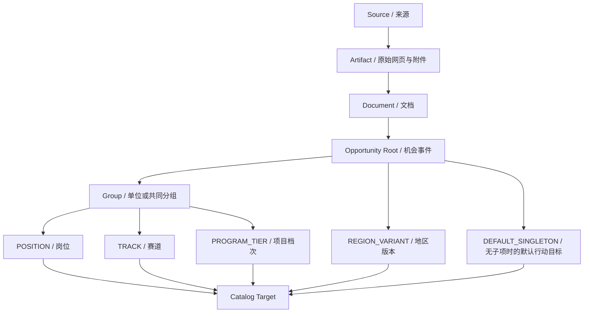

# 02｜可行动机会粒度重构：详细产品与技术规格

## 1. 第一性原理

DeepAha 的公开总览不是“公告库”，而是**用户可行动的 Opportunity Index**。

定义：

> **Actionable Opportunity Target（可行动机会目标）**：用户可以独立做出“了解 / 收藏 / 准备 / 申请 / 放弃 / 设置提醒 / 判断资格”的最小稳定业务对象。

因此：

```text
Source / Website        ≠ Opportunity
Announcement / Document ≠ 必然是一个总览机会
Opportunity Root        ≠ 必然是用户行动单位
Opportunity Unit        = 可能的行动单位
Catalog Target          = 当前真正对用户可浏览/行动的读模型对象
```

## 2. 推荐领域层级



### 2.1 Root 的责任

Root 表示同一公告/计划/赛事/招募事件的稳定父实体，保存：

- 公告名称；
- 发布主体；
- 官方入口；
- 共同条件；
- 共同材料；
- 共同时间节点；
- 共同更正/撤回；
- 关联原件和报告；
- 子单元树。

Root 主要用于**追溯、审核、版本和共同上下文**。

### 2.2 Unit 的责任

Unit 表示根机会内部具有独立业务身份的分项：

- POSITION：岗位；
- TRACK：赛道/方向；
- PROGRAM_TIER：项目/奖项档次；
- REGION_VARIANT：地区适用版本；
- GROUP：单位/部门/共同条件分组；
- DEFAULT_SINGLETON：没有独立子项时，由 Root 派生出的唯一行动目标。

`GROUP` 只组织范围，**默认不能成为总览卡片**。

### 2.3 Catalog Target 的责任

Catalog Target 是可重建的用户侧读模型，不是新的事实权威。它包含：

- 稳定 public id；
- 指向 Root + 可选 Unit；
- 用户看到的标题；
- 继承后的有效展示内容；
- 独立地区、截止、入口、编号；
- 当前状态与更新时间；
- 搜索文本；
- 与父公告、同级单元的关系；
- 备注和使用限制。

## 3. 用户端的正确表现

### 3.1 招聘例子

输入：

```text
城市工程研究院青年人才引进
├─ 工程研究中心
│  ├─ A01 工程研究助理
│  └─ A02 技术项目管理员
└─ 共同条件：科研诚信、最低服务期等
```

当前错误总览：

```text
1. 城市工程研究院青年人才引进（2个岗位）
```

目标总览：

```text
1. A01 工程研究助理
   城市工程研究院 · 宁波 · 青年人才引进

2. A02 技术项目管理员
   城市工程研究院 · 宁波 · 青年人才引进
```

点击 A02 后：

- 首屏是“技术项目管理员”；
- 展示 A02 自己的学历、岗位类别、人数；
- 下方明确展示“本公告共同条件”；
- 可以打开父公告；
- 可以切换“同一公告还有 1 个岗位”；
- 收藏、提醒、资格判断、反馈只绑定 A02；
- 父公告的更正可影响 A01/A02，但系统知道影响范围。

### 3.2 没有子项时

一项单独奖学金、一项单独人才补贴、一项单独科研项目如果没有独立子单元：

- 创建 `DEFAULT_SINGLETON`；
- 用户仍只看到 1 张正常机会卡；
- 不强迫数据生产方虚构子岗位。

## 4. 哪些 Unit 应该成为行动目标

### 4.1 确定性基本规则

1. `GROUP`：永不直接成为默认 Catalog Target。
2. `POSITION`：默认 Actionable。
3. `TRACK`：当赛道有独立报名/资格/材料/结果时 Actionable；纯展示分类可仅为 Group-like 容器。
4. `PROGRAM_TIER`：有独立资格、权益或申请路径时 Actionable。
5. `REGION_VARIANT`：地区差异实际改变资格、金额、办理或入口时 Actionable。
6. Root 没有任何可行动子项：生成 `DEFAULT_SINGLETON`。
7. 结构无法判断时：不得随意把几十行内容压成 1 个“网站机会”；标 `GRANULARITY_UNRESOLVED`，允许作为带备注的临时父级展示，但必须进入质量队列。

### 4.2 不能只相信模型的 `actionable=true`

WMA 可以提出层级和 Unit kind，但最终是否进入 Catalog Target，由 DeepAha 的结构规则决定。模型输出是候选结构，不拥有产品身份批准权。

## 5. 字段继承模型

不要把父级共同条件复制成每个岗位的“独立事实”。

建议公开视图同时保留：

```text
own_fields        # 本岗位/赛道直接字段
ancestor_fields   # 父公告/分组适用于本单元的共同展示字段
effective_fields  # 仅用于展示的组合视图，保留 origin/scope
```

每条有效字段至少带：

- `field_id`
- `label`
- `value`
- `scope_origin = ROOT | GROUP | UNIT`
- `scope_id`
- `state`
- `notes`
- `evidence[]`
- `usage.display`
- `usage.qualification`
- `usage.date_action`

### 5.1 同名字段不能简单覆盖

例如 Root 写“报名截止 10月10日”，岗位写“材料提交 10月8日”。不能因为两个 label 都含“截止”就只留一个。

展示可并列；用于提醒必须经过“时间节点语义 + 作用域”解析。SG1 只解决粒度，不强行完成所有时间语义；不能确定时仍禁用精确提醒。

## 6. 推荐的当前产品数据模型

### 6.1 保留

- `sources`
- `opportunities`：继续作为 Root identity
- `product_result_snapshots`
- `product_overview_revisions`
- `product_overview_decisions`
- `product_overview_publications`：继续保存“审核通过的根内容版本”

### 6.2 新增：轻量 Unit Identity

建议新增当前产品自己的表，而不是直接挂回旧 P9-B 的完整正式事实外键链：

```text
product_opportunity_units
- id UUIDv7 PK
- public_id UNIQUE  # unit_<32hex>
- opportunity_id FK
- parent_unit_id nullable self FK
- source_unit_key
- normalized_source_unit_key
- kind
- canonical_label
- code nullable
- lifecycle_status ACTIVE/RETIRED/UNKNOWN
- first_seen_revision_id
- last_seen_revision_id
- created_at / updated_at

UNIQUE(opportunity_id, normalized_source_unit_key)
```

### 6.3 新增：Catalog Target 读模型

```text
product_catalog_targets
- id UUIDv7 PK
- public_id UNIQUE            # unit_... 或兼容 root opp_...
- opportunity_id FK
- unit_id nullable FK
- publication_id FK
- target_kind ROOT_SINGLETON / UNIT
- target_type POSITION/TRACK/...
- title
- parent_title
- issuer
- region
- deadline nullable
- status CURRENT/UPDATE_PENDING/WITHDRAWN/SUPERSEDED
- content JSON
- searchable_text TEXT
- created_at / updated_at
```

Catalog Target 是可从已通过 Publication + Unit identity 重建的投影，因此它不是第二套事实库。

## 7. 为什么不选另外两个简单方案

### 方案 A：前端直接把 children 平铺

拒绝。

因为收藏、提醒、搜索、更新、资格、反馈仍绑定根 opportunity，数据语义没变。

### 方案 B：把每个岗位直接创建成一个新的 Opportunity

不作为主方案。

优点是改动看似少；但长期会造成：

- 同一公告共同内容重复 N 次；
- 更正关系重复维护；
- 父公告身份丢失；
- 赛道/档次/地区层级难表达；
- 一个岗位从公告 A 移到补充公告 B 时 identity 容易漂移；
- 以后还要重新引入父子实体。

### 方案 C：Root + Unit + Catalog Target

采用。

它同时满足：

- 审核仍然一次整包；
- 用户按具体岗位/赛道浏览；
- 公共条件只保留一份权威上下文；
- 行动和个性化能够针对最小目标；
- 后续生命周期、资格、排序都能正确落位。

## 8. 稳定身份

Unit identity 优先级：

1. WMA / 来源给出的稳定 `id / source_record_key / position_code`；
2. 父路径 + 单元代码；
3. 父路径 + 规范化名称 + 明确结构位置；
4. 仅在无法稳定识别时使用版本内临时 key，并标记 `IDENTITY_WEAK`，不用于跨版本自动合并。

禁止：

- 仅按岗位标题相似度自动合并；
- 仅因顺序相同就认为是同一岗位；
- 删除后重新出现时自动当同一身份而没有来源依据。

旧 P9-B 的 alias / lineage 思想可作为 SG3 的后续参考。

## 9. 审核页面如何变化

仍然只有一次“通过 / 不通过”。但预览必须把业务粒度说清楚：

```text
本次返回
1 份公告
2 个岗位
2 个预计进入总览的行动目标
0 个整体阻断
5 条局部备注
```

审核员可以查看：

- 公告共同内容；
- 分组；
- 每个岗位/赛道；
- 每个问题属于哪个 scope；
- 哪些单元被局部排除。

审核员**不需要逐岗位点批准**。

通过以后：

- 一次决定生成多个 Catalog Target；
- 回执返回 `opportunity_public_ids` 与 `catalog_target_ids`；
- “查看收录结果”显示本次产生的具体岗位列表。

## 10. 用户状态必须迁移到 Target

当前 `(account_id, opportunity_id)` 无法让同一公告保存两个岗位。

SG1 必须把下列状态升级到 target 粒度：

- 收藏/行动；
- 反馈；
- 截止提醒；
- 站内变化通知；
- `fit()`；
- 推荐结果。

### 10.1 迁移原则

不破坏现有数据：

- Root 无子项：旧 Action 可安全映射到 singleton target；
- Root 有多个子项：旧“整公告收藏”不能擅自映射到某一个岗位，应保留为 legacy announcement follow，提示用户重新选择具体岗位；
- 迁移先备份；SQLite/PG 都用追加迁移，不靠 drop-all 重建。

## 11. API 目标

### 列表

`GET /api/catalog`

返回 **Catalog Target**，不是 Root Publication。

新增建议字段：

```json
{
  "id": "unit_...",
  "target_kind": "UNIT",
  "unit_kind": "POSITION",
  "title": "技术项目管理员",
  "parent_title": "城市工程研究院青年人才引进",
  "code": "A02",
  "issuer": "城市工程研究院",
  "region": "宁波",
  "deadline": null,
  "notes": [],
  "sibling_count": 2,
  "root_id": "opp_..."
}
```

### 详情

`GET /api/catalog/{target_public_id}`

同时返回：

- target-local fields；
- applicable ancestor fields；
- root metadata；
- sibling summary；
- evidence；
- action URL；
- currentness status。

### 父公告

提供只读父级接口，例如：

`GET /api/opportunities/{opp_public_id}`

它是“公告总览/来源上下文”，不再默认出现在用户机会列表。

## 12. 前端验收

手机 390px 视口必须看到：

- 卡片第一标题是具体岗位/赛道；
- 父公告是次级说明；
- 岗位代码可见；
- 地区、截止/不确定状态可见；
- 有备注时显示影响，不用红色整页报错；
- 点击进入具体岗位详情；
- “同一公告还有 N 个岗位”可切换；
- 收藏 A02 后，A01 不自动收藏。

电脑审核端：

- 按公告审核；
- 在同一预览中查看所有具体行动目标；
- 一次整体决定。

## 13. SG1 必须通过的测试矩阵

1. 1 公告 + 2 POSITION → catalog total = 2。
2. GROUP 不进入 catalog。
3. 没有子项 → 1 singleton target，旧体验不退化。
4. 1 公告 + 100 岗位 → 稳定分页，不能把 100 岗位塞进一个超大卡片响应。
5. 搜索岗位专业词只返回相关 target；共同字段仍可被所有适用 target 搜到。
6. 收藏 position-01 不影响 position-02。
7. 反馈、提醒、行动状态均 target-scoped。
8. 父公告共同备注在两个岗位中可见，但只保存一份根内容。
9. 同 unit stable key 新版本复用同 `unit_` public id。
10. 新增岗位产生新 target；未有明确撤回证据时，旧岗位不能仅因本次 WMA 漏掉就自动撤回。
11. 已证实错误的单元可局部排除，其他岗位仍能整体收录。
12. 招聘、竞赛、政策各至少一个回归样本不退化。
13. 旧 root-only 已收录数据能继续打开。
14. 当前 78 项产品测试除被明确替换的粒度断言外全部保持通过。
15. 使用至少一份真实 WMA 返回完成本地验收，并记录“公告数 / 可行动单元数 / 总览卡片数”的对应关系。
